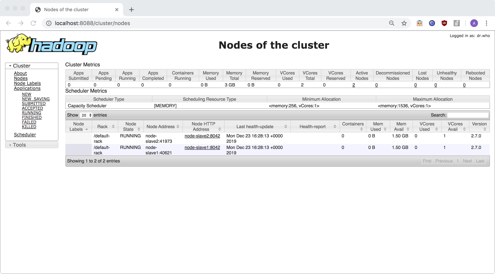

# Micro-Cluster Lab Using Docker, To Experiment With Spark & Dask on Yarn

## Credit to aminelemaiz

For more details about this project please refer to [article](https://lemaizi.com/blog/creating-your-own-micro-cluster-lab-using-docker-to-experiment-with-spark-dask-on-yarn/)


### Get Started

Downloaded geoip datasets from:
[geoip datasets downloads](https://www.maxmind.com/en/accounts/*/geoip/downloads)

### Project Folder Tree

```
├── docker-compose.yml
├── Dockerfile
├── bin
│   ├── fetch-data.sh
│   ├── restart-etl-service.sh
│   ├── secure-image.sh
│   ├── run-adhoc-notebook.sh
├── confs
│   ├── config
│   ├── core-site.xml
│   ├── hdfs-site.xml
│   ├── mapred-site.xml
│   ├── requirements.req
│   ├── slaves
│   ├── spark-defaults.conf
│   └── yarn-site.xml
│   └── hadoop-env.xml
├── datasets
│   ├── private/
│   └── public
    │   ├── alice_in_wonderland.txt
    │   └── iris.csv
├── notebooks
│   ├── PySpark-Yield-Data.ipynb
│   ├── Dask-Yarn-Yield-Data.ipynb
└── script_files
    └── bootstrap.sh
```

### Run Microcluster

```bash
./bin/restart-etl-service.sh
```

### Create the base container image

```bash
docker build . -t cluster-base
```

### Run the cluster or micro-lab

```bash
docker-compose up -d
```

### Yarn resource manager UI

Access the Yarn resource manager UI using the following link : http://localhost:8088/cluster/nodes



### Jupyter Notebook with starters notebooks

Access Jupyter Notebook using this link : http://localhost:8888/


### Stopping the micro-lab

```
docker-compose down
```

